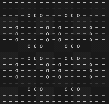
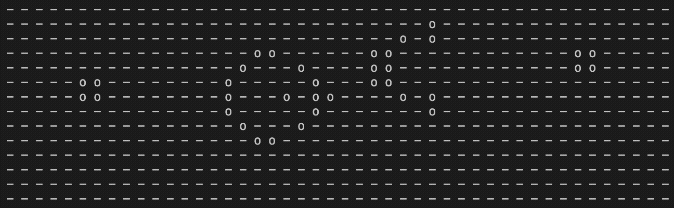

# C++ MPI Game of Life Simulator & Pattern Finder

This project is a high-performance C++ implementation of Conway's Game of Life, a cellular automaton devised by mathematician John Horton Conway in 1970. 

The engine features both sequential and parallelized (MPI) execution models to simulate grid evolution. Additionally, it includes a parallelized pattern-hunting algorithm that searches randomly generated grids to discover "Still Lifes"—stable patterns that remain constant across generations.

---

## Key Features

* **Sequential & Parallel Execution:** Run standard simulations sequentially, or leverage **MPI (Message Passing Interface)** to distribute grid processing across multiple nodes/cores for massive performance gains.
* **Still Life Finder:** An automated, parallelized search engine that iterates through randomized grid configurations to discover stable, unchanging cellular patterns.
* **Flexible Initialization:** Load specific starting patterns from text files (e.g., gliders, oscillators) or generate seeded random grids.
* **Built-in Benchmarking:** Includes an integrated benchmarking suite to test strong and weak scaling across varying thread counts (1, 2, 4, 8+).
* **Robust Testing:** Full unit test coverage ensuring the accuracy of grid evolution and boundary conditions.

---

## Project Structure

```text
/
├── app/              # Application executables (Simulators & Pattern Finder)
│   └── outputs/      # Directory for generated simulation results
├── benchmark/        # Scaling and performance benchmarking suite
├── GolLib/           # Core Game of Life library (Grid and Iterator logic)
├── test/             # Unit tests and sample pattern data
├── README.md         # Documentation
└── Analysis.md       # Scaling report and block decomposition logic

```

---

## Build Instructions

This project uses **CMake** for building. Ensure you have CMake (3.21+) and an MPI implementation (like OpenMPI) installed on your system.

```bash
# 1. Generate the build files
cmake -B build -S .

# 2. Compile the project
cmake --build build

```

---

## Command Line Interface

The generated executables accept the following flags to configure the simulation and search parameters:

### General & Simulation Flags
| Flag | Description | Type |
| --- | --- | --- |
| `-f, --file` | Path to an input pattern file (e.g., `glider.txt`) | String |
| `-r, --random` | Generates a random grid `<rows> <cols> <num_alive>` | Int Int Int |
| `-g, --generations` | Number of generations to simulate | Integer |
| `-s, --seed` | *(Optional)* Seed value for random grid generation | Integer |
| `-d, --delay` | *(Optional)* Delay between frames in milliseconds | Integer |
| `-o, --output` | *(Optional)* Filename for the final state output | String |

### Still Life Finder Flags

| Flag | Description | Type |
| :--- | :--- | :--- |
| `-r, --random` | Initialise grid randomly `<rows> <cols> <num_alive>` | Int Int Int |
| `-n, --stillLifes` | Target number of still life grids to find | Integer |
| `-t, --trials` | Maximum number of trials for searching (across all processes) | Integer |
| `-g, --generations` | Maximum number of generations to simulate per trial | Integer |
| `-s, --seed` | *(Optional)* Specify a seed for random initialisation | Integer |

---

## Usage Examples

### 1. Sequential Simulation (`GolSimulator`)

Simulate a specific pattern from a file:

```bash
./build/bin/GolSimulator --file test/data/glider.txt --generations 30 --delay 300

```

Simulate a randomly generated $20 \times 20$ grid with an inital 50 alive cells:

```bash
./build/bin/GolSimulator --random 20 20 50 --generations 50

```

### 2. Parallel Simulation (`GolSimulatorMPI`)

*Note: Replace `-np <num_processes>` with your desired thread/process count.*

Simulate a large random grid across 8 processes:

```bash
mpirun -np 8 ./build/bin/GolSimulatorMPI --random 50 50 500 --generations 200 --output mpi_random_final.txt

```

### 3. Pattern Hunting (`GolStillLifeFinder`)

Search for 5 Still Life patterns using 4 parallel processes, capping each trial at 100 generations:

```bash
mpirun -np 4 ./build/bin/GolStillLifeFinder --random 10 10 30 --stillLifes 5 --trials 1000 --generations 100

```

---

## Testing & Benchmarking

To verify the core game logic against known oscillators and gliders, run the test suite:

```bash
./build/bin/GolTests

```

To run the benchmarking suite and evaluate MPI strong/weak scaling across 1, 2, 4, and 8 threads:

```bash
./build/bin/GolBenchmarks -n 1,2,4,8

```

---

## Showcases





